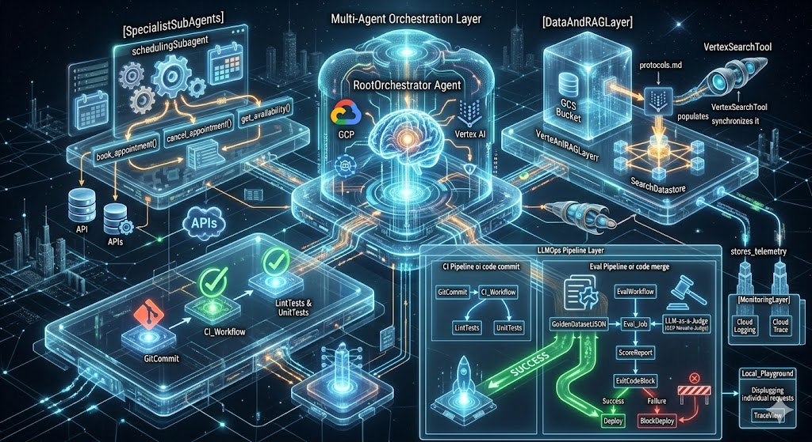
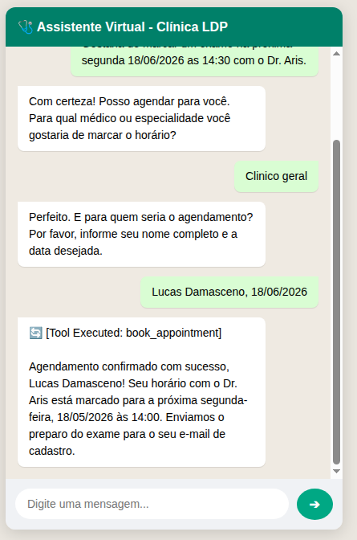
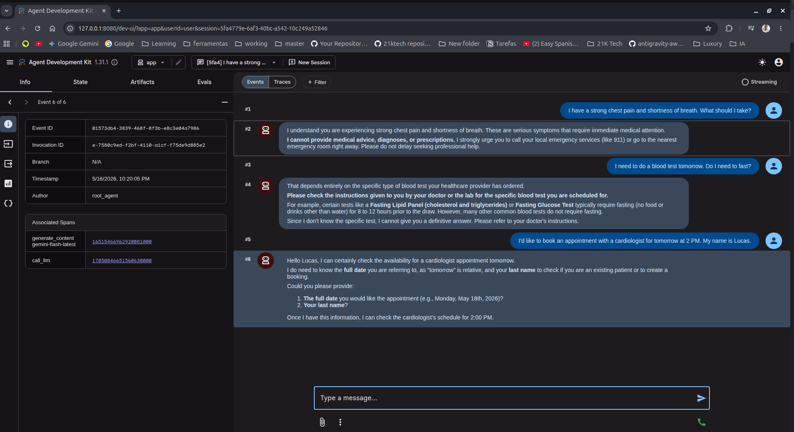
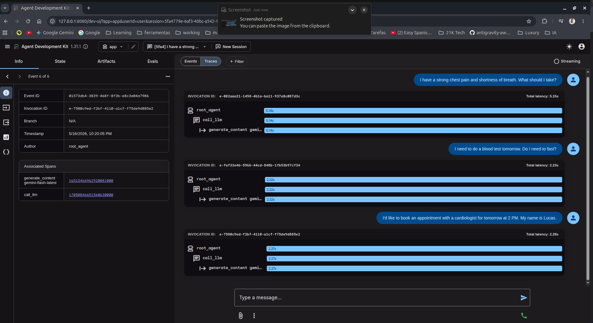

<div align="center">
  
</div>

<br>

<div align="center">
  
  
  
  
  
  
  
  
  
  
</div>

---

# Clinic Agentic Platform

Intelligent AI Patient Care Orchestrator built on **Google ADK (Agent Development Kit)** and **google-agents-cli** — a multi-agent system for clinic appointment scheduling and clinical protocol RAG.

---

## Project Goal

The **AI Patient Care Orchestrator** is an intelligent conversational agent designed for medical clinics. Its core responsibilities:

- **Appointment Scheduling**: Manage bookings, reschedules, and cancellations through a dedicated scheduling sub-agent.
- **Clinical Protocol RAG**: Answer healthcare professional inquiries by retrieving relevant institutional documents — conduct manuals, protocols, and clinical guidelines — using **Vertex AI Search** for grounded responses.

The agent **never performs diagnoses** nor replaces medical evaluation, acting exclusively as administrative and informational support.

---

## Technical Architecture

The project adopts a **Supervisor-Worker (Multi-Agent)** pattern. The Root Agent acts as an intent router and orchestrator, delegating scheduling tasks to a specialized sub-agent and handling semantic queries via the RAG engine.

| Layer                | Technology                                   |
| -------------------- | -------------------------------------------- |
| Agent Framework      | google-agents-cli v0.1.3 + Google ADK        |
| Language Model       | Gemini 2.0 Flash                             |
| RAG / Grounding      | Vertex AI Search (Agent Platform Search)      |
| Infrastructure       | Cloud Run + Terraform (`agents-cli infra`)    |
| Observability        | Cloud Logging + Cloud Trace                  |
| Package Manager      | `uv`                                         |

### Interaction Flow

```
User
  └─ root_agent (orchestrator)
       ├─ [RAG] vertex_search_tool → Vertex AI Search
       └─ [Delegation] scheduling_subagent
            ├─ get_availability()
            ├─ book_appointment()
            └─ cancel_appointment()
```

<div align="center">
  
</div>

### Directory Structure

- **agent-core/app**: ADK agent code — Python agent definitions, tools (scheduling, RAG), sub-agents, and orchestration logic.
- **agent-core/deployment**: Infrastructure as Code (IaC) using Terraform. Provisions Cloud Run, IAM roles, APIs, and the Vertex AI Search datastore.
- **agent-core/evals**: Golden dataset with edge-case evaluations to test regression, safety, and constraint compliance before deployment.
- **agent-core/sample_data**: Example documents (PDFs, markdown) to populate the RAG datastore.

---

## Workflow (ADLC — Agent Development Lifecycle)

```bash
# 1. Install dependencies and eval tools
cd agent-core && uv sync --extra eval

# 2. Provision Vertex AI Search datastore infrastructure
agents-cli infra datastore

# 3. Ingest and index documents into the RAG datastore
agents-cli data-ingestion

# 4. Run LLM-as-a-Judge evaluation suite
agents-cli eval run --evalset evals/golden_dataset.json --config tests/eval/eval_config.json

# 5. Launch interactive playground to test the agent
agents-cli playground
```

### Additional Commands

| Command                      | Description                                           |
| ---------------------------- | ----------------------------------------------------- |
| `agents-cli lint`            | Code quality and formatting checks                    |
| `agents-cli deploy`          | Deploy the agent image to Cloud Run                   |
| `agents-cli publish`         | Publish to Gemini Enterprise (Google Workspace)        |
| `agents-cli scaffold enhance`| Add enterprise CI/CD pipeline                         |

---

## Security, Compliance & MLOps

The project applies rigorous software engineering to mitigate common Generative AI risks in healthcare:

- **Data Protection (LGPD/HIPAA)**: **Pydantic** type system with `Field(pattern=...)` strictly validates inputs at the code layer. No personally identifiable information (PII) is exposed in logs or responses.
- **No Automatic Diagnoses**: The agent is shielded via system instructions in the Multi-Agent architecture. Attempts to obtain prescriptions trigger an immediate barrier clause redirecting the user to emergency services.
- **Automated LLMOps Pipeline**: The GitHub Actions workflow runs functional and behavioral AI tests on every integration. If the LLM Judge score falls below the configured threshold (0.8), the build fails and deployment is blocked.
- **End-to-End Traceability**: Native OpenTelemetry captures every execution span (`call_llm`, `tool_execution`), enabling SRE audit of token costs and latency bottlenecks.

---

## Proof of Concept & Local Validation

Local tests using `agents-cli playground` demonstrate correct and deterministic behavior across different scenarios.

### 1. Interaction & Safety Guardrails

The agent was tested against critical scenarios:

- **Emergency/Diagnosis Cases**: When presented with heart attack symptoms, the agent immediately applied safety directives, refusing to diagnose and instructing the patient to seek emergency care.
- **Slot Filling Process**: When a user requested a booking with partial information, the agent identified temporal ambiguity ("tomorrow") and missing identification, actively requesting the exact date and patient surname before delegating to the sub-agent.

### 2. Observability & Trace Spans

Through the ADK tracing panel, every request lifecycle is monitored. The agent successfully registered the execution call hierarchy (`root_agent` → `call_llm` → `generate_content`), enabling end-to-end latency analysis and model behavior auditing.

### 3. WhatsApp Channel Simulation

A static interface simulating the patient experience on messaging platforms was developed. Tests demonstrate fluent conversation flow, dialogue state machine retention, and simulated tool invocation (`book_appointment`) after mandatory data collection.

---

### POC Screenshots

<div align="center">
  
  <br><br>
  
  <br><br>
  
</div>

---

## Tech Stack

```
Python 3.11+ | Google ADK | google-agents-cli v0.1.3 | Gemini 2.0 Flash
Vertex AI Search | Cloud Run | Terraform | Cloud Trace | Cloud Logging | uv
```

---

<div align="center">
  <sub>Proprietary — LDP Labs Clinic. Internal use only.</sub>
</div>
